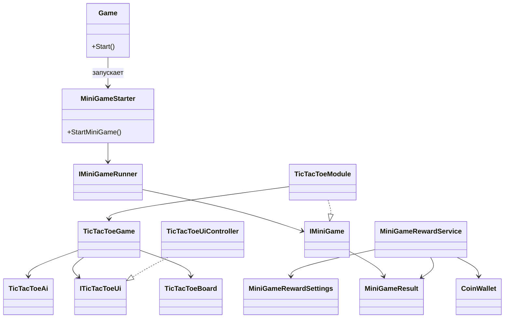

\# Tic-Tac-Toe MiniGame (Unity)


\## Описание


Данный проект реализует миниигру \*\*«Крестики-нолики»\*\* как \*\*встраиваемый модуль\*\*, который может быть запущен из другой игры.

Миниигра не является отдельным приложением — она запускается внешним кодом и после завершения возвращает результат.


Поддерживаемые результаты игры:


\* Победа

\* Поражение

\* Ничья


\---


\# Архитектура миниигры


Миниигра построена модульно и разделена на несколько частей:


\*\*Core MiniGame система\*\*


\* `IMiniGame` — интерфейс миниигры

\* `IMiniGameRunner` — интерфейс запуска миниигры

\* `MiniGameStarter` — сервис запуска миниигры

\* `MiniGameResult` — результат миниигры


\*\*TicTacToe модуль\*\*


\* `TicTacToeModule` — реализация миниигры

\* `TicTacToeGame` — игровая логика

\* `TicTacToeBoard` — состояние игрового поля

\* `TicTacToeAi` — логика противника

\* `TicTacToeUiController` — управление интерфейсом


\*\*Система наград\*\*


\* `MiniGameRewardService`

\* `MiniGameRewardSettings`

\* `CoinWallet`


\---


\# UML диаграмма





\---


\# Запуск миниигры


Миниигра может быть запущена из внешнего кода через `MiniGameStarter`.


Пример:


```csharp

MiniGameStarter.StartMiniGame<TicTacToeModule>(OnMiniGameFinished);

```


Обработка результата:


```csharp

void OnMiniGameFinished(MiniGameResult result)

{

&#x20;   if(result == MiniGameResult.Win)

&#x20;       Debug.Log("Игрок выиграл");


&#x20;   if(result == MiniGameResult.Lose)

&#x20;       Debug.Log("Игрок проиграл");


&#x20;   if(result == MiniGameResult.Draw)

&#x20;       Debug.Log("Ничья");

}

```


\---


\# Основные требования задания


Реализовано:


✔ Играбельные крестики-нолики

✔ Завершение матча (Win / Lose / Draw)

✔ Запуск миниигры из внешнего кода

✔ Возврат результата наружу

✔ Модульная архитектура


\---


