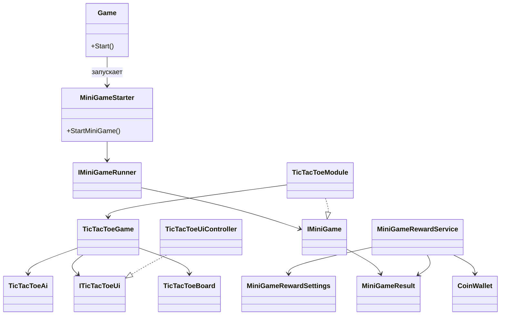

# Tic-Tac-Toe MiniGame (Unity)

## Описание

Данный проект реализует миниигру **«Крестики-нолики»** как **встраиваемый модуль**, который может быть запущен из другой игры.
Миниигра не является отдельным приложением — она запускается внешним кодом и после завершения возвращает результат.

При создании игры спользовался AI агент Codex (gpt-5.2-codex (medium)) встроенный в IDE JetBrains Rider.
Примеры промтов:
* Проидись по сцене и префабам и убедись что всё коректно проставлено.
* Я исправил проблемы, пройдись по скриптам в папке Scripts и проверь все ли скрипты нужны, есть ли предложения для рефакторинга, нет ли лишних скриптов.
* Что нужно сделать чтобы наша мини игра была модулем и могла запускаться из другой игры.
* Подготовь полностью автономный Addressable‑префаб (с GameObjectContext) и шаблон папки. 2. Перенастроить IMiniGameRunner так, чтобы он сам создавался в ProjectContext.

Сам я практически ничего не писал, были проблемы с созданием/изменением префабов, например контексты я делал вручную, а если возникали ошибки в консоли то я их напрявлял к агенту.

---

# UML диаграмма



---

# Запуск миниигры

Чтобы запустить мини игру в Unity нужно нажать клавишу T.

Миниигра может быть запущена из внешнего кода через `MiniGameStarter`.

Пример:

```csharp
MiniGameStarter.StartMiniGame<TicTacToeModule>(OnMiniGameFinished);
```

Обработка результата:

```csharp
void OnMiniGameFinished(MiniGameResult result)
{
    if(result == MiniGameResult.Win)
        Debug.Log("Игрок выиграл");

    if(result == MiniGameResult.Lose)
        Debug.Log("Игрок проиграл");

    if(result == MiniGameResult.Draw)
        Debug.Log("Ничья");
}
```
